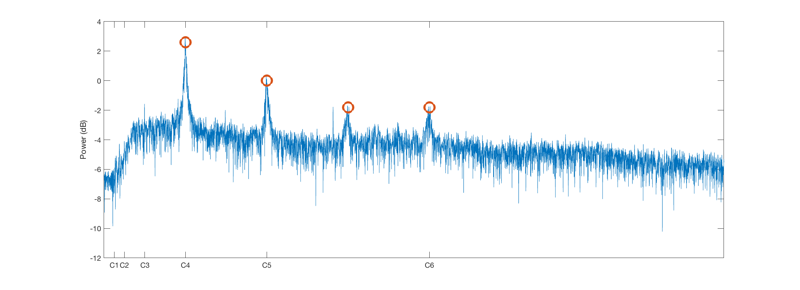
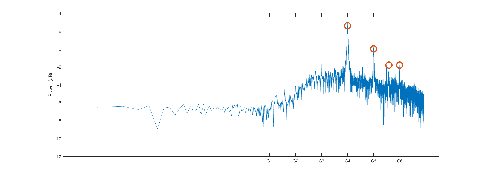
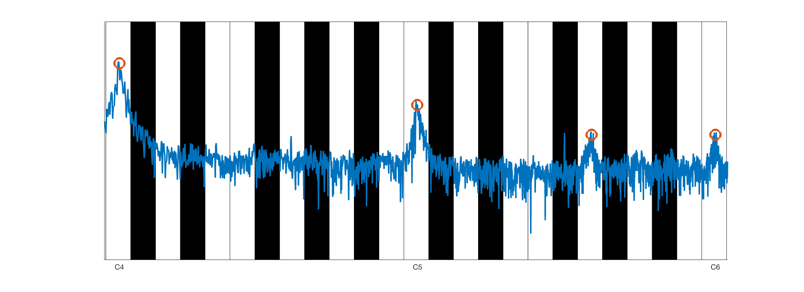
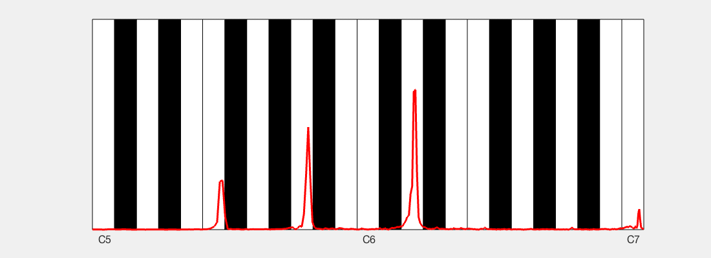
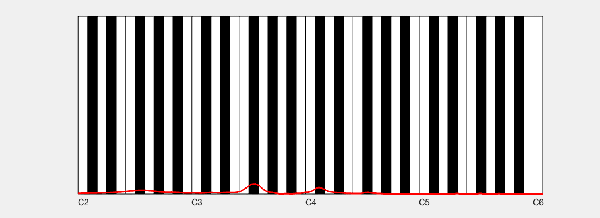
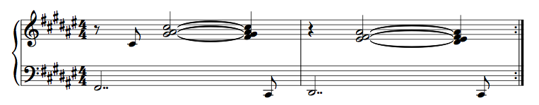
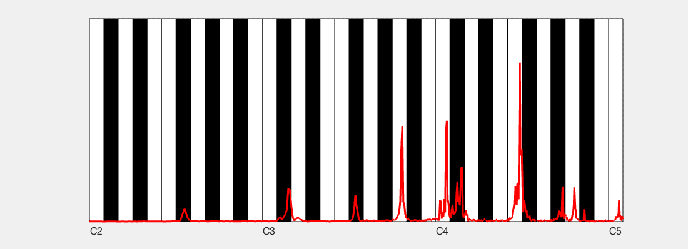

# Visualizing the Fourier transform on a piano
As a musician and electrical engineer I like to think about the Fourier transform as a piano.

## A common way of plotting the Fourier transform

The signal is me humming a C4. We see the overtones C5, G5 and C6 in the plot.

## Another way of plotting the Fourier transform

The same signal (me humming a C4), but the horizontal axis has been scaled logarithmically. Consequentially, the octaves are now *equally spaced*, much like on a piano!

## Plotting the Fourier transform on a piano

Now we can easily project the power spectrum on a piano backdrop.

## `load('train.mat')`

Analysis of the Matlab built-in "train whistles" sound byte. We see that it is composed of an inverted D minor chord

## Twin Peaks Theme

Using this visual support, it becomes pretty easy to transcribe the cluster chords:

## Simon Åkesson's Gbmaj7#9#11no3

Audio from [Gbmaj7#9#11no3][video].

[video]: https://www.youtube.com/watch?v=A9QAW4qXCn4

