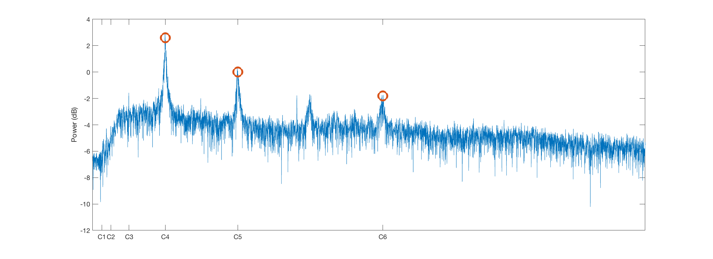
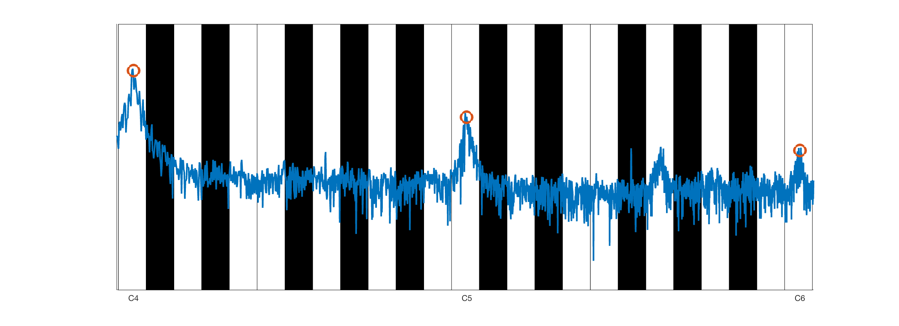
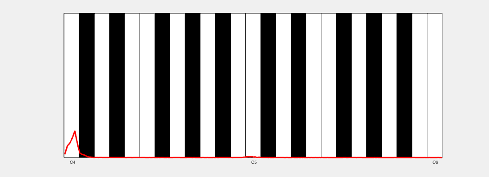

# Visualizing the Fourier transform on a piano
As a musician and electrical engineer I like to think about the Fourier transform as a piano.

## A common way of plotting the Fourier transform

The signal is me humming a C4. We see the overtones C5, G5 and C6 in the plot.

## Another way of plotting the Fourier transform

The same signal (me humming a C4), but the horizontal axis has been scaled logarithmically. Consequentially, the octaves are now equally spaced, much like on a piano!

## Plotting the Fourier transform

Now we can easily project the power spectrum on a piano backdrop.

## Me singing an arpeggiated C7 chord

The notes in a C7 chord are C, E, G and Bb.
